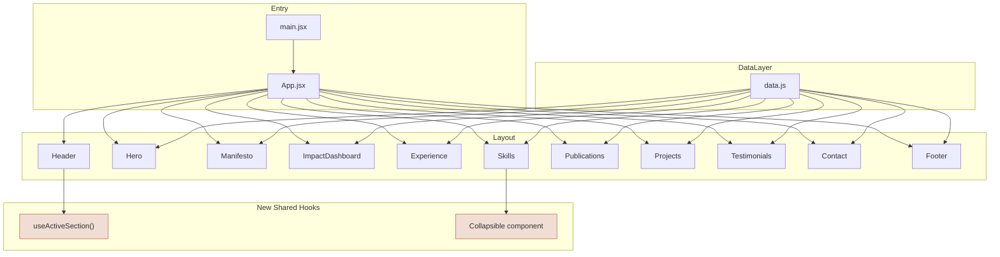
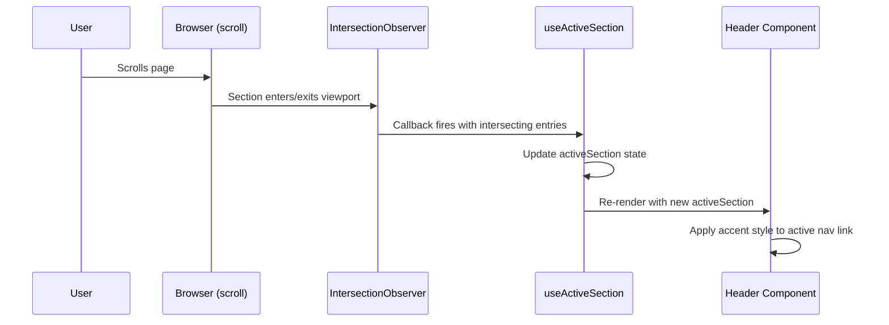
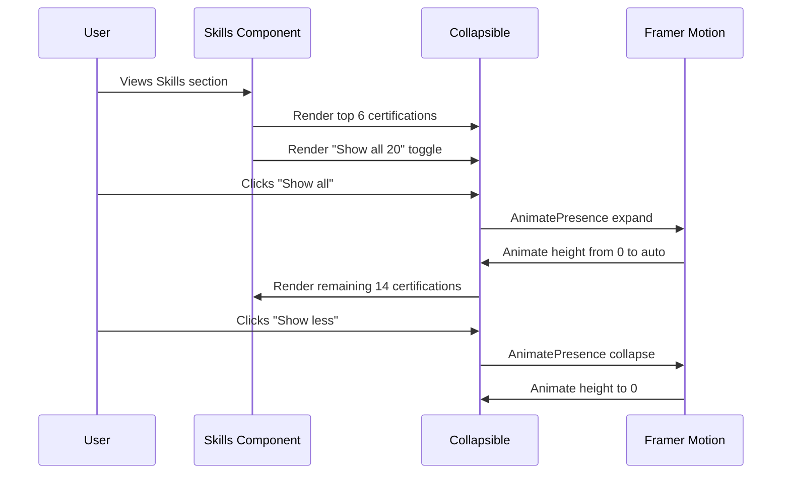
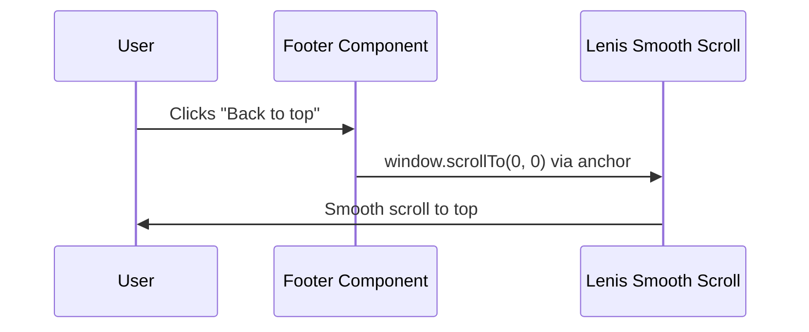

# Design Document: Portfolio Refinement

## Overview

This feature is a comprehensive refinement pass on the existing stabgan.com portfolio — an Anthropic-inspired React site built with Vite 7, React 19, Tailwind CSS v4, and Framer Motion. The goal is to elevate the portfolio from "good" to "gasp-worthy" through content curation (trimming certifications, test scores, honors), visual rhythm improvements (dark inverted sections, stronger contrast), UX polish (active nav state via IntersectionObserver, current role indicator, collapsible sections, back-to-top), typography fixes (Playfair Display italic), hero CTA cleanup, footer enhancement, mobile performance tuning, and dead dependency removal.

All changes are purely frontend — no backend, no API calls. The Anthropic design identity (warm cream palette, bold borders, serif headings, generous whitespace, asymmetric buttons) must be preserved throughout.

## Architecture

The existing architecture is a single-page React app with a flat component structure. The refinement does not change the architecture — it enhances individual components and adds two new shared utilities (IntersectionObserver hook, collapsible wrapper).



## Sequence Diagrams

### Active Nav State — Scroll Tracking



### Collapsible Certifications



### Back to Top



## Components and Interfaces

### Component 1: useActiveSection Hook (NEW)

**Purpose**: Track which section is currently in the viewport using IntersectionObserver and expose the active section ID for nav highlighting.

**Interface**:
```jsx
// src/hooks/useActiveSection.js
function useActiveSection(sectionIds: string[], options?: {
  rootMargin?: string,   // default: "-20% 0px -75% 0px"
  threshold?: number     // default: 0
}): string | null
```

**Responsibilities**:
- Create a single IntersectionObserver watching all section elements
- Return the ID of the currently most-visible section
- Clean up observer on unmount
- Handle missing DOM elements gracefully

### Component 2: Collapsible (NEW)

**Purpose**: Generic animated expand/collapse wrapper for content sections (used by certifications, potentially reusable).

**Interface**:
```jsx
// src/components/Collapsible.jsx
function Collapsible({
  children,              // Content to show/hide
  isExpanded: boolean,   // Controlled expand state
  duration?: number      // Animation duration in seconds, default 0.4
}): JSX.Element
```

**Responsibilities**:
- Animate height from 0 to auto using Framer Motion
- Preserve smooth animation without layout shift
- Support `prefers-reduced-motion`

### Component 3: Header (MODIFIED)

**Purpose**: Add active nav state highlighting based on scroll position.

**Changes**:
- Import and use `useActiveSection` hook
- Apply accent color / underline to the active nav link
- Active state: `text-accent` + bottom border or underline via `link-underline` active variant

### Component 4: Hero (MODIFIED)

**Purpose**: Replace "Read more" secondary CTA with "Download resume" or remove entirely.

**Changes**:
- Remove `<a href="#about" className="btn-secondary">Read more</a>`
- Optionally replace with a "Download resume" link pointing to a PDF in `/public`
- Reduce character animation delay on mobile (use `window.matchMedia` or CSS)

### Component 5: Skills (MODIFIED)

**Purpose**: Curate certifications (top 6-8 visible, rest collapsible), filter test scores, move arts diplomas out of honors.

**Changes**:
- Split certifications into `featured` (first 6-8) and `rest`
- Add expand/collapse toggle using Collapsible component
- Filter `testScores` to only show GATE Statistics, GATE DA, CodeVita, PCAP
- Remove Fine Arts and Vocal Classical diplomas from honors list

### Component 6: Experience (MODIFIED)

**Purpose**: Add "Current" visual indicator on the first (current) role.

**Changes**:
- Check `exp.current` flag (already exists in data.js)
- Render a small "Current" badge with accent styling
- Add accent left border or subtle background treatment

### Component 7: Testimonials (MODIFIED)

**Purpose**: Fix typography (italic font weight) and improve background contrast.

**Changes**:
- Use dark inverted treatment (`bg-[#141413]`, `text-[#FAF9F5]`) instead of barely-visible `bg-bg-alt`
- Ensure all text colors adapt to dark background
- Italic quotes will render correctly once Playfair Display italic is loaded

### Component 8: Contact (MODIFIED)

**Purpose**: Optionally apply dark inverted section treatment for visual rhythm.

**Changes**:
- If Testimonials gets dark treatment, Contact stays light (or vice versa) — only one dark section needed for rhythm
- Decision: Testimonials gets the dark treatment (it's the "social proof" section — dark bg adds gravitas)

### Component 9: Footer (MODIFIED)

**Purpose**: Add "Back to top" link and optional tagline.

**Changes**:
- Add `↑ Back to top` anchor link with smooth scroll
- Add a small tagline (e.g., "Built with React & good taste")
- Maintain existing copyright and domain link

### Component 10: main.jsx (MODIFIED)

**Purpose**: Load Playfair Display italic weight for proper testimonial rendering.

**Changes**:
- Add `import "@fontsource/playfair-display/latin-400-italic.css"`

### Component 11: data.js (MODIFIED)

**Purpose**: Curate content — mark featured certifications, filter test scores, restructure honors.

**Changes**:
- Add `featured: true` flag to top certifications (Stanford, MIT, AWS, PCAP, Azure AI-900)
- Remove WBBSE, Raven's IQ, Standard Progressive Matrices, WBJEE from `testScores`
- Remove Fine Arts and Vocal Classical diplomas from `honors`
- Weave arts background into `personal.bio` narrative

## Data Models

### Certification (existing, enhanced)

```javascript
// Current
{ name: string, issuer: string, year: string }

// Enhanced — add featured flag
{ name: string, issuer: string, year: string, featured?: boolean }
```

**Validation Rules**:
- `featured` is optional, defaults to `false`
- At most 8 certifications should have `featured: true`

### Test Scores (existing, filtered)

```javascript
// Kept entries only:
[
  { name: "GATE Statistics (ST)", score: "AIR 410", year: "2024" },
  { name: "GATE Data Science & AI (DA)", score: "AIR 4,860", year: "2024" },
  { name: "TCS CodeVita", score: "Rank 1,200 / 100K+", year: "2019" },
  { name: "PCAP (Python Institute)", score: "90%", year: "2023" },
]
```

### Honors (existing, trimmed)

```javascript
// Remove arts diplomas, keep academic honors:
[
  "Swami Vivekananda Merit cum Means Scholarship — Govt. of West Bengal (4 years)",
  "PNTSE Rank 2 Zonal, Rank 46 West Bengal",
]
```

### Nav Active State

```javascript
// useActiveSection return type
activeSection: string | null  // e.g., "about", "impact", "experience"
```

## Algorithmic Pseudocode

### Active Section Detection Algorithm

```javascript
// useActiveSection.js
function useActiveSection(sectionIds) {
  const [activeSection, setActiveSection] = useState(null);

  useEffect(() => {
    const observer = new IntersectionObserver(
      (entries) => {
        // Find the entry that is intersecting with the largest ratio
        const visible = entries
          .filter((entry) => entry.isIntersecting)
          .sort((a, b) => b.intersectionRatio - a.intersectionRatio);

        if (visible.length > 0) {
          setActiveSection(visible[0].target.id);
        }
      },
      { rootMargin: "-20% 0px -75% 0px", threshold: 0 }
    );

    sectionIds.forEach((id) => {
      const el = document.getElementById(id);
      if (el) observer.observe(el);
    });

    return () => observer.disconnect();
  }, [sectionIds]);

  return activeSection;
}
```

**Preconditions:**
- `sectionIds` is a non-empty array of valid DOM element IDs
- Each ID corresponds to a `<section>` element in the DOM

**Postconditions:**
- Returns the ID of the section currently in the "active zone" (top 20%-25% of viewport)
- Returns `null` if no section is in view (e.g., at very top of page before first section)
- Observer is cleaned up on unmount

### Collapsible Animation Algorithm

```javascript
// Collapsible.jsx
function Collapsible({ children, isExpanded, duration = 0.4 }) {
  return (
    <AnimatePresence initial={false}>
      {isExpanded && (
        <motion.div
          initial={{ height: 0, opacity: 0 }}
          animate={{ height: "auto", opacity: 1 }}
          exit={{ height: 0, opacity: 0 }}
          transition={{ duration, ease: [0.25, 0.46, 0.45, 0.94] }}
          style={{ overflow: "hidden" }}
        >
          {children}
        </motion.div>
      )}
    </AnimatePresence>
  );
}
```

**Preconditions:**
- `isExpanded` is a boolean controlled by parent
- `children` is valid React content

**Postconditions:**
- When `isExpanded` transitions `false → true`: content animates from height 0 to auto
- When `isExpanded` transitions `true → false`: content animates from current height to 0
- No layout shift during animation (overflow hidden)

### Certification Splitting Algorithm

```javascript
// In Skills.jsx
const VISIBLE_COUNT = 6;

const featuredCerts = certifications.filter((c) => c.featured);
const remainingCerts = certifications.filter((c) => !c.featured);

// If fewer than VISIBLE_COUNT are featured, fill from remaining
const visibleCerts = featuredCerts.length >= VISIBLE_COUNT
  ? featuredCerts.slice(0, VISIBLE_COUNT)
  : [...featuredCerts, ...remainingCerts.slice(0, VISIBLE_COUNT - featuredCerts.length)];

const hiddenCerts = certifications.filter((c) => !visibleCerts.includes(c));
```

**Preconditions:**
- `certifications` array exists and has entries
- Some entries have `featured: true`

**Postconditions:**
- `visibleCerts` contains exactly `VISIBLE_COUNT` items (or all if total < VISIBLE_COUNT)
- `hiddenCerts` contains the rest
- Featured certs always appear in `visibleCerts`

### Mobile Animation Optimization

```javascript
// In Hero.jsx — reduce stagger delay on mobile
const isMobile = typeof window !== "undefined" && window.matchMedia("(max-width: 640px)").matches;
const CHAR_DELAY = isMobile ? 0.018 : 0.035; // ~288ms vs ~560ms for 16 chars

const charVariants = {
  hidden: { opacity: 0, y: isMobile ? 20 : 40 },
  visible: (i) => ({
    opacity: 1,
    y: 0,
    transition: {
      duration: isMobile ? 0.35 : 0.5,
      delay: 0.3 + i * CHAR_DELAY,
      ease: [0.25, 0.46, 0.45, 0.94],
    },
  }),
};
```

**Preconditions:**
- `window.matchMedia` is available (client-side only)

**Postconditions:**
- On mobile (≤640px): total hero animation ~288ms (vs 560ms)
- On desktop: unchanged behavior
- Respects `prefers-reduced-motion` via existing CSS media query

## Key Functions with Formal Specifications

### Function 1: useActiveSection()

```javascript
function useActiveSection(sectionIds: string[]): string | null
```

**Preconditions:**
- `sectionIds` is a non-empty array of strings
- Each string corresponds to an existing DOM element ID

**Postconditions:**
- Returns the ID of the most-visible section in the viewport's "active zone"
- Returns `null` when no section intersects
- Does not cause memory leaks (observer disconnected on cleanup)

**Loop Invariants:** N/A (event-driven, not loop-based)

### Function 2: Collapsible render

```javascript
function Collapsible({ children, isExpanded, duration }): JSX.Element
```

**Preconditions:**
- `isExpanded` is a boolean
- `duration` is a positive number (default 0.4)

**Postconditions:**
- Renders children with animated height when `isExpanded` is true
- Renders nothing (exits with animation) when `isExpanded` is false
- No content visible during collapsed state

### Function 3: Certification split logic

```javascript
function splitCertifications(certifications, visibleCount): { visible, hidden }
```

**Preconditions:**
- `certifications` is an array of certification objects
- `visibleCount` is a positive integer

**Postconditions:**
- `visible.length <= visibleCount`
- `visible.length + hidden.length === certifications.length`
- All `featured: true` items appear in `visible` (up to `visibleCount`)

## Example Usage

### Active Nav Highlighting in Header

```jsx
// Header.jsx
import { useActiveSection } from "../hooks/useActiveSection";
import { navLinks } from "../data";

export default function Header() {
  const sectionIds = navLinks.map((l) => l.href.replace("#", ""));
  const activeSection = useActiveSection(sectionIds);

  return (
    <ul className="hidden md:flex items-center gap-8">
      {navLinks.map((l) => {
        const isActive = activeSection === l.href.replace("#", "");
        return (
          <li key={l.href}>
            <a
              href={l.href}
              className={`link-underline text-[13px] transition-colors duration-200 ${
                isActive
                  ? "text-accent after:w-full"
                  : "text-text-muted hover:text-text"
              }`}
            >
              {l.label}
            </a>
          </li>
        );
      })}
    </ul>
  );
}
```

### Collapsible Certifications in Skills

```jsx
// Skills.jsx (certifications section)
const [showAll, setShowAll] = useState(false);

<div className="grid sm:grid-cols-2 gap-x-16">
  {visibleCerts.map((c, i) => (
    <CertRow key={i} cert={c} />
  ))}
</div>

<Collapsible isExpanded={showAll}>
  <div className="grid sm:grid-cols-2 gap-x-16">
    {hiddenCerts.map((c, i) => (
      <CertRow key={i} cert={c} />
    ))}
  </div>
</Collapsible>

<button
  onClick={() => setShowAll(!showAll)}
  className="text-xs text-accent font-mono mt-4 hover:underline"
>
  {showAll ? "Show less" : `Show all ${certifications.length}`}
</button>
```

### Current Role Badge in Experience

```jsx
// Experience.jsx
<div className="flex flex-col sm:flex-row sm:items-baseline sm:justify-between gap-1 mb-1">
  <div className="flex items-center gap-3">
    <h3 className="text-lg font-serif font-medium text-text">{exp.role}</h3>
    {exp.current && (
      <span className="text-[10px] font-mono uppercase tracking-wider text-accent border border-accent px-2 py-0.5">
        Current
      </span>
    )}
  </div>
  <span className="text-xs text-text-muted font-mono shrink-0">{exp.period}</span>
</div>
```

### Dark Testimonials Section

```jsx
// Testimonials.jsx — dark inverted treatment
<section
  id="testimonials"
  className="section-border py-28 sm:py-32 px-6 bg-[#141413] text-[#FAF9F5]"
>
  {/* All child text colors override to inverse palette */}
  <p className="text-xs uppercase tracking-[0.2em] text-[#9C9A95] font-mono mb-12">
    Testimonials
  </p>
  <blockquote>
    <p className="font-serif italic text-[clamp(1.5rem,3.5vw,2.5rem)] font-medium leading-[1.35] text-[#FAF9F5]">
      &ldquo;...&rdquo;
    </p>
  </blockquote>
</section>
```

### Footer with Back to Top

```jsx
// Footer.jsx
<footer className="py-10 px-6 border-t-2 border-border-bold">
  <div className="max-w-[1200px] mx-auto flex flex-col sm:flex-row items-center justify-between gap-3 text-xs text-text-muted">
    <span>© {new Date().getFullYear()} {personal.name}</span>
    <a href="#" className="link-underline hover:text-text transition-colors">
      ↑ Back to top
    </a>
    <a href={personal.website} className="link-underline hover:text-text transition-colors">
      {personal.handle}.com
    </a>
  </div>
</footer>
```

## Correctness Properties

*A property is a characteristic or behavior that should hold true across all valid executions of a system — essentially, a formal statement about what the system should do. Properties serve as the bridge between human-readable specifications and machine-verifiable correctness guarantees.*

### Property 1: Certification partition — no data loss

*For any* certifications array split into visible and hidden sets, the sum of visible and hidden counts must equal the total certifications count, and every certification must appear in exactly one of the two sets.

**Validates: Requirements 1.1, 1.3, 1.6**

### Property 2: Featured certifications always visible

*For any* certifications array where some entries have `featured: true`, all featured certifications must appear in the visible set (up to the visible count limit).

**Validates: Requirements 1.1, 1.2**

### Property 3: Active section membership

*For any* list of section IDs passed to useActiveSection, the returned value must always be a member of that list or null — never an ID outside the input set.

**Validates: Requirements 5.1, 5.2, 5.3**

### Property 4: Active nav link matches active section

*For any* active section ID returned by useActiveSection, exactly one navigation link in the Header must have accent styling, and that link must correspond to the active section ID.

**Validates: Requirements 5.4, 5.5**

### Property 5: Current badge renders iff current is true

*For any* experience entry, the "Current" badge is rendered adjacent to the role title if and only if that entry has `current: true`.

**Validates: Requirements 8.1, 8.3**

### Property 6: Mobile animation parameters

*For any* viewport width, if the width is 640px or less then the hero character animation delay must be ≤ 0.02s and vertical displacement must be 20px; if the width is greater than 640px then the delay must be 0.035s and vertical displacement must be 40px.

**Validates: Requirements 11.1, 11.2, 11.3**

## Error Handling

### Error Scenario 1: Missing Section DOM Element

**Condition**: `useActiveSection` receives a section ID that doesn't exist in the DOM (e.g., section removed but navLinks not updated).
**Response**: Skip the missing element — `document.getElementById` returns null, observer simply doesn't observe it.
**Recovery**: No crash. The nav link for that section won't highlight, but everything else works.

### Error Scenario 2: Empty Certifications Array

**Condition**: `certifications` array is empty or all entries lack `featured` flag.
**Response**: `visibleCerts` will be empty or filled from `remainingCerts`. Toggle button hidden if total ≤ VISIBLE_COUNT.
**Recovery**: Graceful degradation — section renders with whatever data is available.

### Error Scenario 3: Playfair Display Italic Fails to Load

**Condition**: Font file fails to load (network error, CDN issue).
**Response**: Browser falls back to faux-italic (current behavior) or Georgia italic.
**Recovery**: No visual breakage — just slightly less polished italic rendering.

### Error Scenario 4: IntersectionObserver Not Supported

**Condition**: Very old browser without IntersectionObserver support.
**Response**: Hook returns `null` permanently — no nav highlighting.
**Recovery**: Nav links still work for navigation, just no active state. IntersectionObserver has 97%+ browser support so this is extremely unlikely.

## Testing Strategy

### Unit Testing Approach

- Test `useActiveSection` hook with mocked IntersectionObserver
- Test certification split logic: featured prioritization, count correctness, edge cases (0 featured, all featured)
- Test data.js exports: verify filtered test scores, trimmed honors, featured cert count
- Snapshot tests for dark Testimonials section color classes

### Property-Based Testing Approach

**Property Test Library**: fast-check

- **Certification split property**: For any array of certifications with random `featured` flags and any `visibleCount`, `visible.length + hidden.length === total` and all featured items appear in visible (up to visibleCount).
- **Active section property**: For any ordered list of section IDs, the returned active section is always a member of the input list or null.

### Integration Testing Approach

- Scroll simulation tests: verify active nav state changes as viewport moves through sections
- Collapsible animation: verify content is hidden/shown and toggle text updates
- Mobile viewport tests: verify reduced animation delays at ≤640px
- Full page render: verify no console errors, all sections render, dark section has correct colors

## Performance Considerations

- **IntersectionObserver** is used instead of scroll event listeners — no jank, no throttling needed, runs off main thread.
- **Collapsible** uses Framer Motion's `AnimatePresence` which handles mount/unmount efficiently — hidden content is not in the DOM when collapsed.
- **Mobile hero animation**: Reducing char delay from 35ms to 18ms cuts total animation time from ~560ms to ~288ms, improving perceived load speed on mobile.
- **Font loading**: Adding one italic weight (~20KB woff2) is negligible. Already using `@fontsource` which bundles only needed weights.
- **Dead dependency removal**: Removing `simplex-noise` and `@fontsource/space-grotesk` reduces bundle size slightly.

## Security Considerations

- No new external API calls or data fetching introduced.
- All links use `rel="noopener noreferrer"` for external targets (already in place).
- No user input handling — pure static content.
- Resume PDF (if added) should be served from `/public` — no dynamic file generation.

## Dependencies

**Existing (no changes)**:
- `react` ^19.2.4, `react-dom` ^19.2.4
- `framer-motion` ^12.36.0
- `tailwindcss` ^4.2.1, `@tailwindcss/vite` ^4.2.1
- `lenis` ^1.3.18
- `lucide-react` ^0.577.0
- `@fontsource/playfair-display` ^5.2.8 (italic weight already available in package, just needs import)
- `@fontsource/inter` ^5.2.8
- `@fontsource/jetbrains-mono` ^5.2.8

**Removed**:
- `simplex-noise` ^4.0.3 (NeuralCanvas deleted)
- `@fontsource/space-grotesk` ^5.2.10 (no longer used)

**New**:
- None — all refinements use existing dependencies
